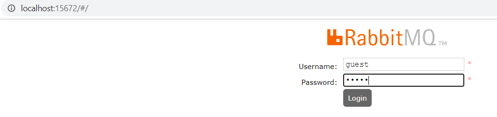

This tutorial will demonstrate the process of setting up a RabbitMQ AMQP server 
and a spring boot application to connect to RabbitMQ server and publish/subscribe to messages for further processing
#Software Requirements:
	JDK 11
	Maven
	IntelliJ IDEA
	RabbitMQ server
	
# Setup RabbitMQ Server
1. RabbitMQ is built on Erlang, so first step is to install Erlang
	Go to Erlang downloads page (https://www.erlang.org/downloads) and install the .exe file
	
	
	
2. Run the .exe file to install
3. Once the install is successful it creates a system environment variable ERLANG_HOME
4. Now go to rabbitmq downloads(https://www.rabbitmq.com/download.html) and download RabbitMQ installer

    
5. Run the downloaded .exe file and install rabbitmq server
6. Run the below rabbitmq command and enable plugins to access RabbitMQ management console using browser. 
    > rabbitmq-plugins enable rabbitmq_management
    
    
7. Windows -> rabbitmq service - stop

    
8.  Windows -> rabbitmq service - start
    
    
    
9. Go to rabbitmq server page and login as guest user - http://localhost:15672/#/
    >username - **guest**  
    password - **guest**
    
    

##Steps to create spring boot application to publish and subscribe to messages in queue
1. Add spring boot rabbitmq maven dependency

        <dependency>
            <groupId>org.springframework.boot</groupId>
                <artifactId>spring-boot-starter-amqp</artifactId>
        </dependency>
        
2. Create a sender component which sends messages to queue using exchange key. In this example, we use a direct exchange wherein the message directly goes to the queue whose binding key matches the routing key. These are defined in the configuration file
3. Create a listener component to receive the messages from queue
4. A controller to expose rest endpoint for sending messages
5. Start the rabbit MQ server and spring boot application
6. In this example, employee object sent in request payload is published and received by message queue

